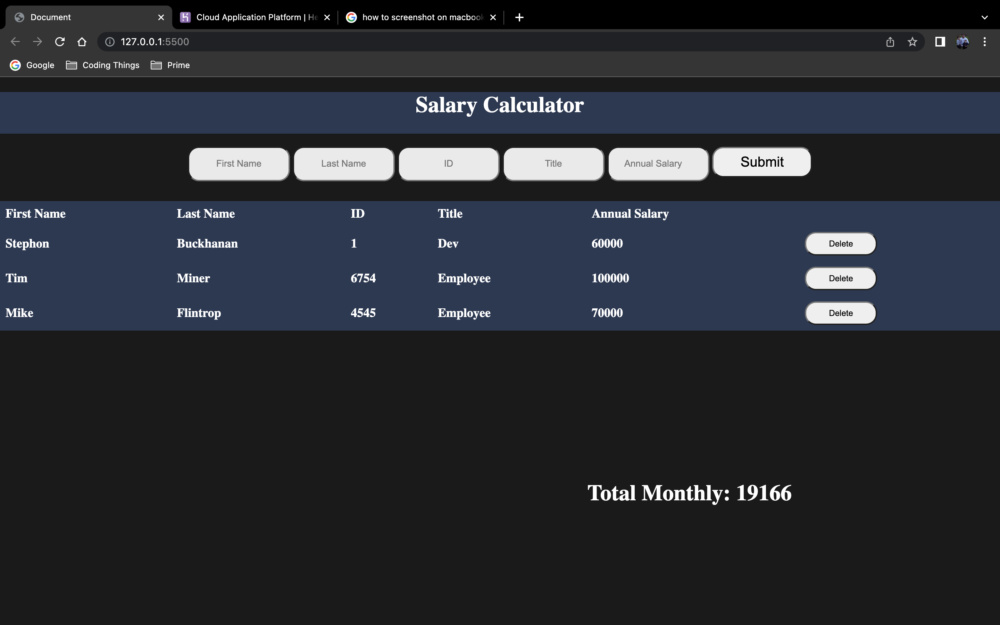

  

# SALARY CALCULATOR

## Description

_Duration: 4 Hours_

With this application you are able to calculate your monthly costs based on employees salary. Along with that you will see all of the data that an employee enters into the form on the screen. When you go over your monthly max of $20,000 your monthly total will turn red. Additionally you will be able to remove employees and get rid of their salary contribution to the total.

## Screen Shot

### Prerequisites

NONE

How does someone use this application? Tell a user story here.

1. Fill out each input block
2. When you are finished click the Submit button.
3. You will see your employee on the page.
4. Click the delete button next to that employee to delete them

## Built With

HTML CSS Javascript jQuery

## Acknowledgement

Thanks to [Prime Digital Academy](www.primeacademy.io) who equipped and helped me to make this application a reality. Thank you to my instructor Liz when helped answer any questions I may have had while building this!

## Support

If you have suggestions or issues, please email me at [buckhananstephon@gmail.com](https://www.google.com)
